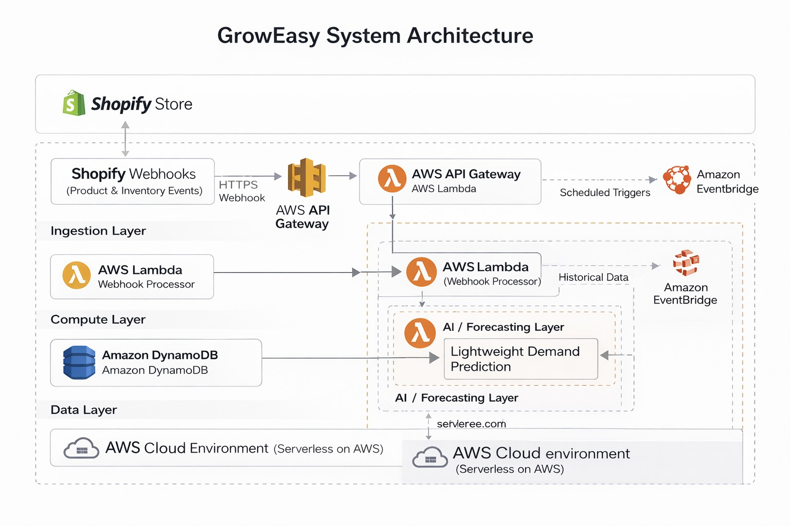

# 🛍️ GrowEasy: AI‑Driven Retail Optimization for Shopify Stores
🌟 GrowEasy – AI‑Powered Inventory &amp; Pricing Optimization for Shopify  Unlock smart retail management with real-time demand forecasting, automated insights, and a full serverless architecture—built entirely on AWS with SageMaker, Lambda, DynamoDB, and React.

## 🛍️ What is Shopify?

[Shopify](https://www.shopify.com) is a popular **e-commerce platform** that allows anyone to easily create and manage an online store.  shopify dashbord.png.png
It helps businesses sell products, track orders, manage inventory, and handle payments — all in one place.
Think of it like a **digital shopping mall** that gives store owners everything they need to run a business online, without writing code.

Here is my shopify patner developer account :

### 🌐 Supported Platforms
- **Shopify** (primary via webhooks & Admin API), **WooCommerce** (REST API), **BigCommerce** (official APIs), **Magento / Adobe Commerce** (enterprise-scale forecasting).
- ✅ I choosed shopify here to complete my project

## 🤔 Real-Life Problem This Project Solves (Problem → Solution → Benefit)
💢 What problems store owners face without GrowEasy

✅ How GrowEasy solves each problem

🏆 What benefits (advantages) users gain

| 💢 **Problem Without GrowEasy**                                       | ✅ **How GrowEasy Solves It**                                                      | 🏆 **Advantage for Store Owners**                             |
|----------------------------------------------------------------------|------------------------------------------------------------------------------------|---------------------------------------------------------------|
| ❌ Manual inventory planning                                          | 🧠 Uses LSTM-based forecasting to predict product demand                          | 📦 Avoids overstock/understock losses                         |
| ❌ No real-time data-driven insights                                  | 📊 Dashboard shows live trends, demand forecasts, and low-stock alerts            | ⚡ Fast, informed decision-making                             |
| ❌ Missed opportunities during peak demand                            | 🔔 SNS alerts store owners about high-demand products in advance                   | 💰 Maximizes sales by staying stocked                         |
| ❌ Static pricing that ignores demand                                 | 🔄 Integrates demand forecasting into pricing logic (future upgrade)               | 📈 Enables smart, dynamic pricing                             |
| ❌ Shopify analytics not optimized for future planning                | 📂 Stores product + order history in DynamoDB, makes it ML-ready                   | 🔍 Better long-term strategy with historical + forecasted data|
| ❌ High infrastructure cost for ML pipelines                          | ☁️ Fully serverless using AWS Lambda + SageMaker + EventBridge                    | 💸 Zero server maintenance, pay-as-you-go                     |
| ❌ No automation for restocking strategy                              | ⏰ Hourly ML pipeline auto-updates forecasts and recommendations                   | 🔄 Hands-free inventory management                           |
| ❌ Difficult for non-tech founders to understand backend logic        | 🧱 Modular dashboard + visual insights + alerting system                           | 👩‍💼 Accessible to non-technical business users               |

---

## 📌 What GrowEasy IS / IS NOT

### ✅ GrowEasy IS
- A serverless, AI-driven retail optimization backend 🤖
- Integrated with Shopify via real webhooks 🔗
- Built on AWS using Lambda and DynamoDB ☁️
- Designed for demand forecasting and inventory insights 📊
- Focused on real-time data ingestion and analysis ⚡

### ❌ GrowEasy is NOT
- A full SaaS product
- A frontend-heavy application
- A no-code automation tool
- A marketplace or e-commerce platform
- A mock or simulated data project

## 🚀 Full System Architecture (overview) :

## High-Level System Overview

### 🔄 Shopify Integration Flow (Webhook + OAuth Lifecycle)

| 🔢 Step | 📝 Description | 🔍 Why It Matters |
|--------|----------------|-------------------|
| **1️⃣ Create App using Shopify Partner Dashboard** | You create the GrowEasy app inside the Shopify Partner portal. This gives you app credentials (API Key/Secret), scopes, and the ability to install it on a store. | Required to define permissions like `read_products`, and to enable installation into merchant stores. |
| **2️⃣ Install the App in a Merchant’s Store** | The merchant (store owner) installs the GrowEasy app via a secure install link (OAuth or manual). | App is now authorized to access that specific store’s product and inventory data. |
| **3️⃣ Register Webhooks using Shopify Admin API** | After install, your app calls the Admin API to register webhook topics like `products/create` and `products/update`. | These webhooks let Shopify notify your app automatically when product data changes. |
| **4️⃣ Receive Webhook POST Requests (JSON Payload)** | Shopify sends a POST request (with product data) to your specified API endpoint whenever a registered event occurs. | Real-time product events (title, inventory, price, SKU, tags) are pushed out as JSON. |

### 🔄 1. Data Flow / Request Lifecycle (End-to-End)

| 🔧 Component                 | ⚙️ Technology                  | 🔍 Purpose                                                       |
|----------------------------|------------------------------|------------------------------------------------------------------|
| 🛒 Shopify Store           | Shopify Admin API + Webhooks | Captures real-time events like new orders, product updates       |
| 🌐 API Gateway             | Amazon API Gateway           | Secure entry point for Shopify Webhooks                         |
| ⚙️ Lambda Webhook Handler  | AWS Lambda                   | Parses webhook data and stores it in DynamoDB                   |
| 💾 Raw Data Storage        | DynamoDB (GrowEasyWebhookLogs)| Stores incoming order/product data for further analysis          |

**📷 Diagram: Webhook Flow**

  

**📷 Diagram: Monitoring & Logging via CloudWatch**  

---

### ⏱️ 2.ML Pipeline Design (Forecasting Flow)

| 🔧 Component                  | ⚙️ Technology                | 🔍 Purpose                                                       |
|-----------------------------|-----------------------------|------------------------------------------------------------------|
| ⏰ Scheduler                | Amazon EventBridge          | Triggers ML job every hour                                      |
| 📁 Data Exporter Lambda     | AWS Lambda                  | Reads from DynamoDB and writes `products.csv` to S3              |
| 🧠 ML Forecasting           | Amazon SageMaker            | Trains & runs LSTM model on product demand                      |
| 📊 Forecast Storage         | DynamoDB (ProductAnalytics) | Saves forecast results per product                              |
| 📤 Notifications (Optional) | Amazon SNS                  | Sends alerts for low stock or demand spikes                     |

---

### 📈 3. Observability & Monitoring (Logs, Metrics, Traces)

| 🔧 Component               | ⚙️ Technology                  | 🔍 Purpose                                                       |
|--------------------------|------------------------------|------------------------------------------------------------------|
| 🖥️ Frontend               | React + Tailwind CSS         | User-friendly interface to view forecasts and trends            |
| 📊 Charts                 | Recharts                     | Visualize product forecasts and sales trends                    |
| 🔗 API Layer              | AWS API Gateway + Lambda     | Fetches latest forecast data from DynamoDB                      |
| 🔒 Security + Tracing     | IAM, CloudWatch, X-Ray       | Role-based access control and monitoring/tracing                |

**📷 Screenshot: GrowEasy Dashboard UI**
This dashboard is built specifically for retail business owners and inventory managers to monitor forecasted demand, stock levels, and price recommendations in real-time. But, Now here ,
Dashboard fully developed and owned by me as part of the GrowEasy AI-powered retail platform. Responsible for architecture, design, data integration, and deployment.
🔗 [Live Dashboard Demo](https://your-demo-link.com) — You can explore the working example here.

## ⚙️You can add multiple store here in the seeting :

---

### 🛠️ DevOps & Deployment Strategy
| 🔧 Component           | ⚙️ Technology                    | 🔍 Purpose                                      |
|----------------------|--------------------------------|------------------------------------------------|
| 🛡️ IAM               | AWS IAM Roles & Policies       | Secure, least-privilege access control         |
| 📊 Monitoring         | Amazon CloudWatch              | Tracks logs, metrics, invocations, errors      |
| 💥 DLQ                | Lambda DLQs                   | Stores failed events for debugging             |
| 🔎 X-Ray              | AWS X-Ray                      | Full trace of requests across services         |

## 💰 Cost Awareness & Trade-offs

- Serverless compute reduces idle infrastructure costs ☁️
- DynamoDB chosen for **pay-per-request scaling** 📦
- Avoided managed ML pipelines to prevent unnecessary expenses 💸
- No always-on servers or containers 🚫

**Trade-off:**  
Lower operational cost at the expense of advanced training pipelines and model complexity.

## 📊 Features
- Real-time data ingestion from DynamoDB to S3.
- Custom LSTM model training in SageMaker.
- Automated weekly forecasting with EventBridge.
- API endpoint for forecast access.
- Dashboard integration for monitoring.

## 🏆 Hackathon Experience: Codex 2.0  

I built **GrowEasy** during the **Codex 2.0 Hackathon** in just **36 hours**, working under extreme pressure with my team.  
- ✅ **Real-life problem solving** → tackled challenges faced by small Shopify merchants like stockouts and wrong pricing.  
- ✅ **Hands-on project building** → designed and implemented the end-to-end AI + cloud pipeline (Shopify → AWS → AI → Dashboard).  
- ✅ **Dynamic price prediction** → added AI-driven **real-time price recommendation engine** to maximize merchant revenue.  
- ✅ **Worked under time constraints** → completed full architecture, backend pipeline, AI forecasting, and dashboard in less than 2 days.  

This project was not just about coding, but about:  
- Thinking like a **cloud/DevOps engineer** under real-world conditions.  
- Delivering a **production-grade system** in limited time.  
- Learning how to handle **team collaboration, stress, and quick decision making** during a hackathon.  

---

### 📸 Hackathon Moments:  

Here are some snapshots from my **Codex 2.0 journey** while building GrowEasy:  

Also, you can check from here: [LinkedIn](https://www.linkedin.com/in/me-m-gantait/)

✨ This experience made GrowEasy not just a project, but a **real proof of my skills in cloud, AI, and problem-solving under pressure.**

## 💰 Cost Awareness & Trade-offs

- Serverless compute reduces idle infrastructure costs ☁️
- DynamoDB chosen for **pay-per-request scaling** 📦
- Avoided managed ML pipelines to prevent unnecessary expenses 💸
- No always-on servers or containers 🚫

**Trade-off:**  
Lower operational cost at the expense of advanced training pipelines and model complexity.

---

## ⚠️ Explicit Limitations

- No production-grade authentication or access control 🔐
- No automated CI/CD pipeline 🔄
- No real-time dashboard or frontend interface 🖥️
- Forecasting models are basic and not continuously retrained 📉
- Not designed for multi-tenant production workloads 🏢

---

## 🎯 What This Project Demonstrates About Me

- Ability to design **serverless, event-driven architectures** ⚙️
- Hands-on experience with **AWS Lambda and DynamoDB** ☁️
- Real-world **third-party API integration** (Shopify webhooks) 🔗
- Practical understanding of **cloud cost trade-offs** 💰
- Ability to build **end-to-end data pipelines** 🔄
- Focus on **working systems, not theoretical designs** 🧪

## 🙌 Contributions Welcome!

GrowEasy is an open-source initiative, and **we welcome contributions** from developers, data scientists, cloud engineers, and e-commerce enthusiasts!

### 💡 Ideas You Can Work On

| Feature Idea               | Description                                                                 |
|---------------------------|-----------------------------------------------------------------------------|
| 💰 Dynamic Pricing         | Adjust product prices based on forecasted demand and stock levels          |
| 📉 Sales Anomaly Detection | Detect sudden drops/spikes in sales and alert store owners                 |
| 🏬 Multi-Store Support     | Enable GrowEasy to manage multiple Shopify stores under one dashboard       |
| 🔐 Role-Based Dashboard    | Add user authentication and access control for different team members      |
| 📈 Trend Analysis Charts   | Show seasonality and long-term performance trends for each product         |
| 📬 Email Reporting (SNS)   | Send daily/weekly summaries to store owners using Amazon SNS                |

---

### 🛠️ How to Contribute

1. 🍴 Fork the repo
2. 📦 Create a new feature branch: `git checkout -b feature-name`
3. ✅ Make your changes and test them
4. 📬 Submit a pull request describing your enhancement

 🤝 Let's Build This Together!
Made with 💚 by **Manas Gantait**  

                
