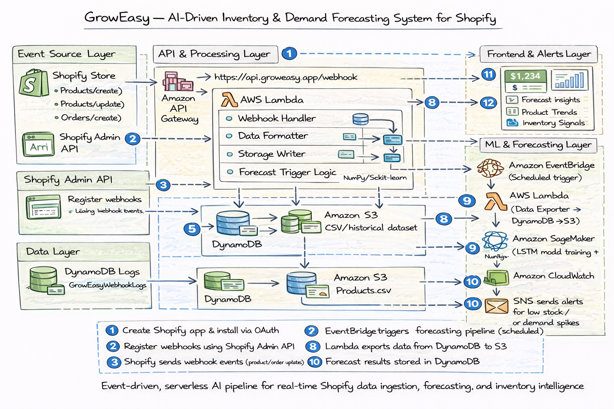

# 🛍️ GrowEasy: AI‑Driven Retail Optimization for Shopify Stores
🌟 GrowEasy – AI‑Powered Inventory &amp; Pricing Optimization for Shopify  Unlock smart retail management with real-time demand forecasting, automated insights, and a full serverless architecture—built entirely on AWS with SageMaker, Lambda, DynamoDB, and React.

**[Shopify](https://www.shopify.com)** 🛍️  is a popular **e-commerce platform**, Shopify is selected as the primary integration platform for this project.


### 🌐 Supported Platforms
- **Shopify** (primary via webhooks & Admin API), **WooCommerce** (REST API), **BigCommerce** (official APIs), **Magento / Adobe Commerce** (enterprise-scale forecasting).


## 🤔 Real-Life Problem This Project Solves (Problem → Solution → Benefit) :

| 💢 **Problem Without GrowEasy**                                       | ✅ **How GrowEasy Solves It**                                                      | 🏆 **Advantage for Store Owners**                             |
|----------------------------------------------------------------------|------------------------------------------------------------------------------------|---------------------------------------------------------------|
| ❌ Manual inventory planning                                          | 🧠 Uses LSTM-based forecasting to predict product demand                          | 📦 Avoids overstock/understock losses                         |
| ❌ No real-time data-driven insights                                  | 📊 Dashboard shows live trends, demand forecasts, and low-stock alerts            | ⚡ Fast, informed decision-making                             |
| ❌ Missed opportunities during peak demand                            | 🔔 SNS alerts store owners about high-demand products in advance                   | 💰 Maximizes sales by staying stocked                         |
| ❌ Static pricing that ignores demand                                 | 🔄 Integrates demand forecasting into pricing logic (future upgrade)               | 📈 Enables smart, dynamic pricing                             |
| ❌ Shopify analytics not optimized for future planning                | 📂 Stores product + order history in DynamoDB, makes it ML-ready                   | 🔍 Better long-term strategy with historical + forecasted data|
| ❌ High infrastructure cost for ML pipelines                          | ☁️ Fully serverless using AWS Lambda + SageMaker + EventBridge                    | 💸 Zero server maintenance, pay-as-you-go                     |
| ❌ No automation for restocking strategy                              | ⏰ Hourly ML pipeline auto-updates forecasts and recommendations                   | 🔄 Hands-free inventory management                           |
| ❌ Difficult for non-tech founders to understand backend logic        | 🧱 Modular dashboard + visual insights + alerting system                           | 👩‍💼 Accessible to non-technical business users               |


## 🚀 Full System Architecture (overview) :


## 📁 Project Structure (Current State) :

This repository contains backend webhook ingestion, ML forecasting pipeline, and a React dashboard — built during rapid development, so structure reflects functional grouping rather than strict layering.
```
GrowEasy/
│
├── Backend/  # Core backend logic (Shopify → AWS pipeline)
│   │
│   ├── Register_Webhook/
│   │   ├── register_webhook.py   # Registers Shopify webhooks via Admin API
│   │   └── GrowEasy.txt          # Notes / webhook payload reference
│   │
│   ├── Webhook_Handler/
│   │   ├── webhookhandler.py     # Processes incoming webhook POST requests
│   │   └── what it does.txt      # Explanation of handler logic
│   │
│   ├── forecast_result_writter/
│   │   ├── forecastResult.py     # Writes ML forecast output
│   │   └── what it does.txt      # Description of forecasting output logic
│   │
│   ├── forecast_trigger/
│   │   ├── index.js              # Triggers forecasting pipeline (EventBridge/Lambda)
│   │   └── what it does.txt      # Notes on trigger behavior
│
├── data/  # Dataset used for ML pipeline
│   ├── befor-forcast.csv         # Raw historical product/order data
│   └── after forecast.txt        # Forecast output results
│
├── Sagemaker/  # ML experimentation & training
│   └── forecasting-notebook.ipynb  # LSTM model training notebook
│
├── codex 2.0/groweasy/  # Frontend (hackathon dashboard build)
│   │
│   ├── public/  # Static assets
│   ├── src/     # React components & UI logic
│   ├── package.json
│   └── tailwind.config.js
│
├── assets/  # Supporting files (images, references)
│
├── README.md          # Project documentation
├── LICENSE            # License file
├── Dashboard.png      # UI preview
├── api_gateway_event.png   # API flow proof
├── cloudwatch_logs.png     # Monitoring proof
└── dynamodb_tables.png     # Data storage proof
```
## 📈 Core Features :

| ✅ What This Project IS | ❌ What This Project is NOT |
|------------------------|---------------------------|
| Real-Time Data Ingestion System — Captures Shopify product and order events via webhooks and processes them through a serverless pipeline | Not a manual data entry or batch-processing system |
| AI-Driven Demand Forecasting — Uses historical product data with LSTM/ML models to predict future demand | Not a rule-based or static analytics dashboard |
| Serverless Processing Architecture — Built using AWS Lambda, EventBridge, and DynamoDB for scalable, event-driven execution | Not a server-based backend requiring infrastructure management |
| Inventory Optimization Engine — Provides actionable insights on stock levels, demand trends, and restocking needs | Not a passive reporting tool with no decision support |
| Automated Workflow Pipeline — Scheduled ML jobs update forecasts and insights without manual intervention | Not a one-time analysis or offline ML experiment |
| Cost-Efficient Cloud Design — Fully serverless architecture minimizing idle infrastructure cost | Not a heavy ML pipeline with high operational overhead |

### 🔄  Request Lifecycle (End-to-End) :

GrowEasy integrates directly with Shopify using webhooks and a serverless backend pipeline to enable real-time data processing.

**App Setup & Installation**  
The GrowEasy app is created via the Shopify Partner Dashboard and installed on a merchant’s store using OAuth, granting secure access to product and inventory data.
***Webhook Registration*** 
Once installed, the system registers webhook events (e.g., product create/update) using the Shopify Admin API to receive real-time store activity.
***Event Ingestion (API Layer)***  
Shopify sends webhook POST requests to an API Gateway endpoint, which acts as a secure entry point for all incoming data.
***Processing (Lambda Backend)*** 
AWS Lambda processes the incoming payload, extracts relevant fields (product, inventory, pricing), and prepares it for downstream usage.
***Data Storage***  
Processed data is stored in DynamoDB for further analysis, forecasting, and historical tracking.

**📷 Diagram: Webhook Flow**


  


### ⏱️ ML Pipeline (Forecasting Flow)

GrowEasy runs an automated, serverless ML pipeline to generate demand forecasts:

- ⏰ **Event Trigger (EventBridge)** → Schedules forecasting job at regular intervals  
- 📁 **Data Extraction (Lambda)** → Reads historical product data from DynamoDB and exports to S3 (`products.csv`)  
- 🧠 **Model Execution (SageMaker / Python)** → Trains and runs LSTM-based forecasting on product demand  
- 📊 **Result Storage (DynamoDB)** → Stores forecast outputs per product for fast retrieval  
- 📤 **Alerting (SNS)** → Sends notifications on low stock or demand spikes  

⚡ **Outcome:** Automated, repeatable forecasting pipeline with no manual intervention  
### 📈 Observability & Monitoring

The system is monitored end-to-end for reliability, visibility, and debugging:

- 🔗 **API Layer (API Gateway + Lambda)** → Serves latest forecast data to the dashboard  
- 📊 **Visualization (React + Recharts)** → Displays trends, forecasts, and usage insights  
- 🔍 **Tracing (X-Ray)** → Provides request-level visibility across services  
- 🔐 **Access Control (IAM)** → Enforces secure, least-privilege access  

⚡ **Outcome:** Full visibility into data flow, system health, and model execution


**Why this design?**  
- Serverless → no infra overhead  
- API abstraction → secure frontend  
- Event + request hybrid → supports both real-time + scheduled insights 

**📷 Diagram: Monitoring & Logging via CloudWatch**  


**📷 Screenshot: GrowEasy Dashboard UI**
This dashboard is built specifically for retail business owners and inventory managers to monitor forecasted demand, stock levels, and price recommendations in real-time. But, Now here ,
Dashboard fully developed and owned by me as part of the GrowEasy AI-powered retail platform. Responsible for architecture, design, data integration, and deployment.
🔗 [Live Dashboard Demo](https://your-demo-link.com) — You can explore the working example here.


## ⚙️You can add multiple store here in the seeting :


## 🧰 Tech Stack :

**☁️ Cloud & Backend**
- AWS Lambda — serverless processing for webhooks, data pipelines, and forecasting  
- API Gateway — secure endpoint for Shopify webhook ingestion  
- DynamoDB — scalable storage for product, order, and forecast data  
- Amazon S3 — stores exported datasets for ML processing  

**🔗 Integration**
- Shopify Admin API — access product, inventory, and order data  
- Shopify Webhooks — real-time event ingestion (products, updates, orders)  

**🧠 Machine Learning**
- Amazon SageMaker — LSTM-based demand forecasting    

**⚙️ Orchestration & Automation**
- Amazon EventBridge — schedules periodic ML jobs and pipeline execution  

**📊 Monitoring & Alerts**
- Amazon CloudWatch — logs, metrics, and system monitoring  
- Amazon SNS — notifications for low stock and demand spikes  

**💻 Frontend**
- React + Tailwind CSS — responsive dashboard UI  
- Recharts — data visualization (trends, forecasts, insights)  

**🔐 Security**
- AWS IAM — role-based access control with least privilege


## ⚡ Quickstart (Run in ~30 seconds) :

 **1️⃣ Clone the repository** 

```bash
git clone https://github.com/your-username/groweasy.git
```

**2️⃣ Setup Backend**

- cd GrowEasy/Backend
- Update webhook endpoint (API Gateway URL)
- Deploy Lambda functions (AWS Console / ZIP)
  
**3️⃣ Configure Shopify Webhooks**
- Add API Gateway endpoint in Shopify
- Subscribe to:
```
products/create
products/update
orders/create
```
**4️⃣ Run Forecasting Pipeline**

- Upload historical data to /data
- Run: Sagemaker/forecasting-notebook.ipynb

**5️⃣ Run Frontend Dashboard**
```
cd "codex 2.0/groweasy"
npm install
npm start
```
## 🏆 Hackathon Experience: Codex 2.0  

I built **GrowEasy** during the **Codex 2.0 Hackathon** in just **36 hours**, working under extreme pressure with my team.  
- ✅ **Real-life problem solving** → tackled challenges faced by small Shopify merchants like stockouts and wrong pricing.  
- ✅ **Hands-on project building** → designed and implemented the end-to-end AI + cloud pipeline (Shopify → AWS → AI → Dashboard).
- 
### 📸 Hackathon Moments:  
Here are some snapshots from my **Codex 2.0 journey** while building GrowEasy:  


Also, you can check from here: [LinkedIn](https://www.linkedin.com/in/me-m-gantait/)


✨ This experience made GrowEasy not just a project, but a **real proof of my skills in cloud, AI, and problem-solving under pressure.** 

## 🛡️ Resilience & Security :

***Failure Handling***
- Retry-safe execution (idempotent Lambda design)  
- Partial failures don’t break full pipeline  
- Errors logged in CloudWatch for traceability  

***Security***
- IAM roles with least privilege (no over-permissioned access)  
- No secrets exposed to frontend  
- API Gateway enforces controlled access + CORS  

***Scalability & Performance***
- Lambda auto-scales with request load  
- DynamoDB handles high-throughput reads/writes  
- Stateless design avoids bottlenecks  

## 🧠 Engineering Philosophy :

***Key Decisions***
- Serverless over containers → faster setup, lower ops cost  
- API abstraction over direct AWS calls → security + simplicity  
- Real data over mock dashboards → credibility  
- Modular design → Lambda, API, frontend decoupled  

***Trade-offs***
- Limited control over long-running workloads  
- Forecasting kept lightweight (not full ML pipeline infra)  
- Depends on AWS API availability  

***Explicit Limitations***
- No enterprise-grade RBAC/auth system  
- Forecasting accuracy depends on historical data quality  
- Not a full FinOps platform (focused scope)  

## 🙌 Contributions Welcome!

GrowEasy is an open-source initiative, and **we welcome contributions** from developers, data scientists, cloud engineers, and e-commerce enthusiasts!

### 💡 Ideas You Can Work On

| Feature Idea               | Description                                                                 |
|---------------------------|-----------------------------------------------------------------------------|
| 💰 Dynamic Pricing         | Adjust product prices based on forecasted demand and stock levels          |
| 📉 Sales Anomaly Detection | Detect sudden drops/spikes in sales and alert store owners                 |
| 🏬 Multi-Store Support     | Enable GrowEasy to manage multiple Shopify stores under one dashboard       |
| 🔐 Role-Based Dashboard    | Add user authentication and access control for different team members      |
| 📈 Trend Analysis Charts   | Show seasonality and long-term performance trends for each product         |
| 📬 Email Reporting (SNS)   | Send daily/weekly summaries to store owners using Amazon SNS                |

---


### 🛠️ How to Contribute

1. 🍴 Fork the repo
2. 📦 Create a new feature branch: `git checkout -b feature-name`
3. ✅ Make your changes and test them
4. 📬 Submit a pull request describing your enhancement

 🤝 Let's Build This Together!
Made with 💚 by **Manas Gantait**  

                
